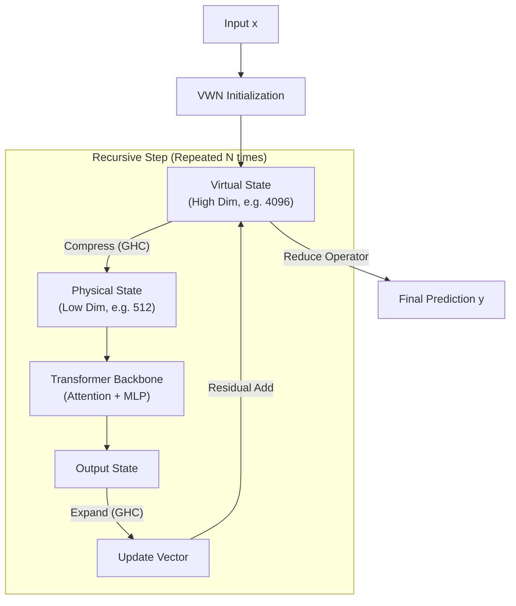

# VRN: Virtual Recursive Networks


[![License: MIT] (https://img.shields.io/badge/License-MIT-yellow.svg)](https://opensource.org/licenses/MIT) [] [](https://pytorch.org/)<svg role="img" viewBox="0 0 24 24" xmlns="http://www.w3.org/2000/svg"><title>Lightning</title><path d="M12 0L1.75 6v12L12 24l10.25-6V6zm-1.775 18l1.08-4.657-2.428-2.397L13.79 6l-1.082 4.665 2.414 2.384z"/></svg>[](#roadmap)
## Architecture

Instead of recursing on single compressed latent $z$ (as in TRM), VRN aims to maintain arbitrary **Over-Width Recursive State ($Z_{virtual}$)**.



## Installation

```bash
git clone https://github.com/maxwell-gao/VirtualRecursiveNetwork.git
cd VirtualRecursiveNetwork
uv sync
```
## Usage

### Dataset Preparation

```bash
# ARC-AGI-1
python -m dataset.build_arc_dataset \
  --input-file-prefix kaggle/combined/arc-agi \
  --output-dir data/arc1concept-aug-1000 \
  --subsets training evaluation concept \
  --test-set-name evaluation

# ARC-AGI-2
python -m dataset.build_arc_dataset \
  --input-file-prefix kaggle/combined/arc-agi \
  --output-dir data/arc2concept-aug-1000 \
  --subsets training2 evaluation2 concept \
  --test-set-name evaluation2

## Note: You cannot train on both ARC-AGI-1 and ARC-AGI-2 and evaluate them both because ARC-AGI-2 training data contains some ARC-AGI-1 eval data

# Sudoku-Extreme
python dataset/build_sudoku_dataset.py --output-dir data/sudoku-extreme-1k-aug-1000  --subsample-size 1000 --num-aug 1000  # 1000 examples, 1000 augments

# Maze-Hard
python dataset/build_maze_dataset.py # 1000 examples, 8 augments
```

## Training Examples


### Maze-Hard

#### Maze-Hard (Loop Transformer TRM reproduction)

`config/arch/loop_transformer.yaml` encodes the same \
$(H_{\text{cycles}}=3, L_{\text{cycles}}=4)$ reasoning schedule as TRM using the generalized loop reasoning block (`models/recursive_reasoning/loop_transformer.py`). To run the Maze pretraining recipe with this variant:

```bash
run_name="pretrain_loop_trm_maze30x30-25k-fabric-loop-trm-fixedParams"
torchrun --nproc-per-node 8 --rdzv_backend=c10d --rdzv_endpoint=localhost:0 --nnodes=1 pretrain.py \
arch=loop_transformer \
data_paths="[data/maze-30x30-hard-1k]" \
evaluators="[]" \
epochs=25000 eval_interval=5000 \
lr=1e-4 puzzle_emb_lr=1e-4 weight_decay=1.0 puzzle_emb_weight_decay=1.0 \
run_name=${run_name} ema=True \
early_stopping=True early_stopping_patience=5 early_stopping_monitor=exact_accuracy early_stopping_mode=max
```

#### Clip Norms
```bash
run_name="pretrain_loop_trm_maze30x30-25k-fabric-loop-trm-fixedParams-clipnorm"
torchrun --nproc-per-node 8 --rdzv_backend=c10d --rdzv_endpoint=localhost:0 --nnodes=1 pretrain.py \
arch=loop_transformer \
data_paths="[data/maze-30x30-hard-1k]" \
evaluators="[]" \
epochs=25000 eval_interval=5000 \
lr=5e-5 puzzle_emb_lr=5e-5 weight_decay=1.0 puzzle_emb_weight_decay=1.0 \
run_name=${run_name} ema=True \
early_stopping=True early_stopping_patience=5 early_stopping_monitor=exact_accuracy early_stopping_mode=max
```

This configuration keeps the same model width ($512$ hidden units, $8$ heads, SwiGLU expansion $4$) while exposing multiple loop states (`z_H`, `z_L`) and a two-stage schedule (`z_L \leftarrow z_H + x`, then `z_H \leftarrow z_L`).


#### Loop Transformer with Muon optimizer
```bash
run_name="pretrain_loop_trm_maze30x30-25k-fabric-loop-trm-muon-noclip"
torchrun --nproc-per-node 8 --rdzv_backend=c10d --rdzv_endpoint=localhost:0 --nnodes=1 pretrain.py \
arch=loop_transformer \
data_paths="[data/maze-30x30-hard-1k]" \
evaluators="[]" \
epochs=50000 eval_interval=5000 \
+optimizer=muon \
lr=0.001 weight_decay=0.1 \
+muon_lr=0.01 +muon_weight_decay=0.1 \
puzzle_emb_lr=5e-5 puzzle_emb_weight_decay=1.0
run_name=${run_name} ema=True
early_stopping=True early_stopping_patience=5 early_stopping_monitor=exact_accuracy early_stopping_mode=max
```


### Sudoku-Extreme

##### Sudoku-Extreme with Fabric Loop Transformer

```bash
run_name="pretrain_sudoku-loop_tf"
torchrun --nproc-per-node 8 --rdzv_backend=c10d --rdzv_endpoint=localhost:0 --nnodes=1 pretrain.py \
arch=loop_transformer \
data_paths="[data/sudoku-extreme-1k-aug-1000]" \
evaluators="[]" \
epochs=50000 eval_interval=5000 \
lr=1e-4 puzzle_emb_lr=1e-4 weight_decay=1.0 puzzle_emb_weight_decay=1.0 \
grad_clip_norm=-1.0 \
run_name=${run_name} ema=True
```

##### Sudoku-Extreme with Fabric Loop Transformer DIS

```bash
run_name="pretrain_sudoku-loop_tf_dis"
torchrun --nproc-per-node 8 --rdzv_backend=c10d --rdzv_endpoint=localhost:0 --nnodes=1 pretrain.py \
arch=loop_transformer_dis \
data_paths="[data/sudoku-extreme-1k-aug-1000]" \
evaluators="[]" \
epochs=50000 eval_interval=5000 \
lr=1e-4 puzzle_emb_lr=1e-4 weight_decay=1.0 puzzle_emb_weight_decay=1.0 \
grad_clip_norm=-1.0 \
run_name=${run_name} ema=True
```


##### Sudoku-Extreme with Fabric Loop Transformer (Muon)

```bash
torchrun --nproc-per-node 8 --rdzv_backend=c10d --rdzv_endpoint=localhost:0 --nnodes=1 pretrain.py \
arch=loop_transformer \
data_paths='[data/sudoku-extreme-1k-aug-1000]' evaluators='[]' \
epochs=50000 eval_interval=5000 \
+optimizer=muon \
lr=0.0003 weight_decay=1.0 \
+muon_lr=0.0005 +muon_weight_decay=1.0 \
puzzle_emb_lr=1e-4 puzzle_emb_weight_decay=1.0 \
grad_clip_norm=-1.0 \
run_name="pretrain_sudoku_muon-fixed-wd" \
ema=True
```

## Roadmap

This project is evolving from a flexible recursive engine into a **Virtual Recursive Network (VRN)**. We are currently transitioning from Phase 1 to Phase 2.

### Phase 1: The Foundation (Current Status)

*Goal: Establish a stable, configurable recursive loop engine.*

  - [x] **Arbitrary State Definitions:** Support for defining multiple latent streams (`z_H`, `z_L`, etc.) with independent or shared weights.
  - [x] **Programmable Execution Stages:** A YAML-based instruction set to define the loop topology (e.g., "Run `z_L` 6 times, then `z_H` 3 times").
  - [x] **Adaptive Computation Time (ACT):** Integrated halting mechanisms (`q_head`) allowing the model to dynamically decide when it has "thought" enough.
  - [x] **Deep Supervision:** Training infrastructure to supervise intermediate reasoning steps.
  - [x] **Task-Specific Embeddings:** Native support for Puzzle/Task identifiers.

### Phase 2: Virtual Width Integration (In Progress)

*Goal: Break the "Memory vs. Compute" trade-off.*

  - [ ] **Virtual State Projection:** Implement connectors to map high-dimensional "Virtual States" (e.g., 4096d) down to the "Physical Backbone" (e.g., 512d) and back.
  - [ ] **Generalized Hyper-Connections (GHC):** Replace standard residual connections with learnable projections to maintain information density across the bottleneck.
  - [ ] **State Expansion:** Update `LoopTransformerInnerCarry` to handle mixed-dimensionality states (storing High-Dim history while computing Low-Dim logic).
  - [ ] **Benchmarking & Ablations:** Evaluate the impact of virtual width on reasoning tasks, comparing against Phase 1 baselines.

-----

##  Configuration Guide

The model's behavior is entirely driven by the YAML configuration.

### Example 1: The "Slow-Fast" System

A hierarchical setup where a "Low-level" state (`z_L`) runs frequently (fast loop) to feed a "High-level" state (`z_H`) that runs less often.

```yaml
states:
  - name: z_H         # The "Executive" state
    layers: 1
  - name: z_L         # The "Worker" state
    layers: 1
    share_weights_with: z_H  # Weight tying for efficiency

stages:
  # Stage 1: Intuition (Fast Loop)
  # Run z_L 6 times, using info from z_H
  - target: z_L
    sources: [z_H]
    include_inputs: true
    repeat: 6 

  # Stage 2: Reasoning (Slow Loop)
  # Update z_H once based on the result of z_L
  - target: z_H
    sources: [z_L]
    repeat: 3
```

### Example 2: The "Deep Stack"

A sequential pipeline that mimics a very deep network using a single shared layer.

```yaml
states:
  - name: z_H
    layers: 1
  - name: z_M
    layers: 1
    share_weights_with: z_H
  - name: z_L
    layers: 1
    share_weights_with: z_H

stages:
  # Cyclic processing: H -> L -> M -> H
  - target: z_L
    sources: [z_H]
  - target: z_M
    sources: [z_L]
  - target: z_H
    sources: [z_M]
```


## License

MIT License. See `LICENSE` for details.

## Acknowledgements
This code is based on Tiny Recursive Models [code](https://github.com/SamsungSAILMontreal/TinyRecursiveModels)